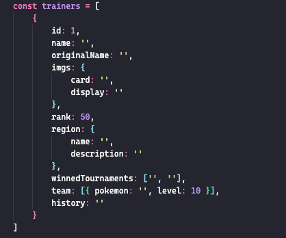

# **Api trainers**

## **Funcionamiento**

* Api en express para pruebas.
* Sin conexcion a BD, funciona con un arreglo en duro en data/trainers.js
* Estructura de los objetos del array trainers:
  * 

## **Ejecutar**

1. npm i
2. npm run dev o npm run start
3. Ir al path http://localhost:3000/trainers
